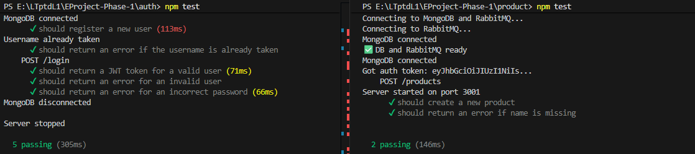

# 🧩 22694611-TranLeKiet-EProject
**Dự án học phần: Lập trình hướng dịch vụ (Service-Oriented Programming)**  
**Giảng viên hướng dẫn:** ThS. Huỳnh Nam  

---

## 🧠 PHẦN 1 — TỔNG QUAN VÀ PHÂN TÍCH HỌC THUẬT  

### 1️⃣ Giới thiệu đề tài  
Dự án **EProject Phase 1** mô phỏng hệ thống **thương mại điện tử phân tán** được xây dựng theo **kiến trúc hướng dịch vụ (SOA)** và triển khai bằng mô hình **Microservices**.  
Các thành phần trong hệ thống hoạt động **độc lập**, giao tiếp với nhau thông qua **API Gateway** và **RabbitMQ** (AMQP protocol).  

Hệ thống gồm 4 dịch vụ chính:  
- **API Gateway** — trung gian định tuyến và điều phối yêu cầu.  
- **Authentication Service** — xác thực, ủy quyền và quản lý người dùng.  
- **Product Service** — quản lý thông tin sản phẩm (CRUD).  
- **Order Service** — tạo và xử lý đơn hàng.  

---

### 2️⃣ Mục tiêu dự án  
- Hiểu và triển khai mô hình **Microservices Architecture**.  
- Ứng dụng cơ chế giao tiếp **Push-based Asynchronous Communication** qua **RabbitMQ (AMQP)**.  
- Tách biệt rõ giữa **các tầng kiến trúc (Clean Architecture)**: controller, service, repository, model.  
- Tăng khả năng mở rộng, tái sử dụng và bảo trì hệ thống trong môi trường dịch vụ.  

---

### 3️⃣ Phạm vi hệ thống  
- Cung cấp nền tảng backend cho hệ thống TMĐT (quản lý sản phẩm, đơn hàng, người dùng).  
- Hỗ trợ giao tiếp bất đồng bộ giữa các dịch vụ.  
- Thích hợp làm mô hình thực hành trong môn **Lập trình hướng dịch vụ**.

---

### 4️⃣ Kiến trúc và mô hình hoạt động  

#### ⚙️ Clean Architecture  
Mỗi **microservice** đều tuân thủ mô hình kiến trúc sạch:  
```
src/
├── models/         → Định nghĩa cấu trúc dữ liệu (schema)
├── repositories/   → Tầng thao tác cơ sở dữ liệu (CRUD)
├── services/       → Xử lý nghiệp vụ
├── controllers/    → Tiếp nhận và phản hồi yêu cầu từ client
├── middlewares/    → Kiểm tra xác thực, log, lỗi, ...
└── routes/         → Định nghĩa endpoint API
```

Cấu trúc này giúp:
- Phân tách rõ ràng giữa các tầng logic.  
- Dễ dàng mở rộng, kiểm thử, và thay thế từng phần mà không ảnh hưởng toàn hệ thống.  

---

### 5️⃣ Giao tiếp bất đồng bộ (Asynchronous Communication)

Hệ thống sử dụng **cơ chế Push-based** qua **AMQP protocol**, triển khai bằng **RabbitMQ**.  

#### 🧩 Cơ chế Push-based:
- Một bên **Publisher (Provider)** xuất bản thông điệp.  
- Một bên **Consumer** lắng nghe và xử lý thông điệp.  
- Dữ liệu truyền qua **Queue**, hỗ trợ **Event-Driven Architecture**.  

RabbitMQ giúp tăng hiệu suất và giảm phụ thuộc trực tiếp giữa các service.

---

### 6️⃣ Mô tả quá trình giao tiếp giữa các dịch vụ  

**Bước 1:**  
Người dùng gửi yêu cầu đặt hàng qua API Gateway → Product Service.  
Product Service **xuất bản thông tin sản phẩm** vào hàng đợi (Product Queue).

**Bước 2:**  
Order Service **lắng nghe Product Queue**, nhận thông tin sản phẩm, đối chiếu giá và tạo **đơn hàng mới trong Orders DB**.

**Bước 3:**  
Khi đơn hàng được tạo, Order Service **xuất bản thông tin đơn hàng** sang Products Queue → xác nhận đơn hàng hợp lệ.

**Bước 4:**  
Product Service lắng nghe Queue, nhận dữ liệu xác minh, tiến hành **in hóa đơn hoặc cập nhật trạng thái đơn hàng**.

---

### 7️⃣ Cấu phần chính trong RabbitMQ Private Exchange  

| Thành phần | Vai trò |
|-------------|----------|
| **Producer** | Gửi thông điệp (xuất bản dữ liệu vào Queue, lưu FIFO trong RAM hoặc DB) |
| **Consumer** | Nhận và xử lý thông điệp từ Queue (theo cơ chế Push-based) |
| **Queue** | Trung gian lưu trữ tạm thời các sự kiện / yêu cầu |

> 🔍 Cấu hình cụ thể được triển khai trong file:  
> `auth/src/controllers/authController.js`
> `product/src/controllers/productController.js`

---

## ⚙️ PHẦN 2 — MÔ TẢ KỸ THUẬT & TRIỂN KHAI

### 🏗️ Cấu trúc hệ thống

```
EProject-Phase-1/
│
├── api-gateway/       → Định tuyến & xác thực request
├── auth/              → Xác thực & quản lý người dùng
├── product/           → CRUD sản phẩm & xuất bản sự kiện
├── order/             → Quản lý đơn hàng & xử lý hàng đợi
└── utils/             → Module tiện ích dùng chung
```

---

### 🧰 Công nghệ & công cụ sử dụng

| Thành phần | Công nghệ |
|-------------|------------|
| Ngôn ngữ | Node.js (JavaScript ES6) |
| Framework | Express.js |
| CSDL | MongoDB (Mongoose ODM) |
| Message Broker | RabbitMQ (AMQP protocol) |
| Authentication | JWT (JSON Web Token) |
| Kiến trúc | Microservices + Clean Architecture |
| Gateway | Express API Gateway / Custom Routing |
| Giao tiếp | REST API + Event-driven Messaging |
| Quản lý gói | npm |
| Môi trường | Docker (tùy chọn triển khai) |

---

### 🚪 API Gateway

**Chức năng chính:**
- Tiếp nhận request từ client và **định tuyến** đến microservice tương ứng.  
- Thực hiện **xác thực & phân quyền (Authentication/Authorization)**.  
- **Chuyển đổi request/response** cho phù hợp với giao thức từng dịch vụ.  
- **Giới hạn tần suất truy cập (Rate limiting)** để tránh quá tải.  
- **Caching** tạm thời các kết quả được truy cập thường xuyên nhằm tối ưu hiệu suất.  

> API Gateway đóng vai trò “bộ điều phối trung tâm”, giúp giảm độ phức tạp của client và bảo vệ backend.

---

### 🔐 Authentication Service
- Quản lý người dùng (đăng ký, đăng nhập).  
- Cấp và xác thực token JWT.  
- Lưu trữ thông tin tài khoản trong MongoDB.  
- Hỗ trợ phân quyền cơ bản cho các API nội bộ.

---

### 📦 Product Service
- Cung cấp API CRUD sản phẩm.  
- Quản lý danh mục, tồn kho, giá bán.  
- Xuất bản dữ liệu sang RabbitMQ để các dịch vụ khác (Order) tiêu thụ.  

---

### 🧾 Order Service
- Nhận thông tin từ Product Queue qua RabbitMQ.  
- Tạo, xác nhận và lưu đơn hàng mới.  
- Phản hồi dữ liệu sang Queue để Product Service cập nhật trạng thái đơn hàng.

---

### 🧱 Hướng dẫn cài đặt & chạy

#### Yêu cầu
- Node.js >= 16  
- MongoDB đang chạy  
- RabbitMQ server (local hoặc docker)  

#### Cài đặt

```bash
# Clone project
git clone https://github.com/your-username/22694611-TranLeKiet-EProject.git
cd 22694611-TranLeKiet-EProject

# Cài đặt gói chung
npm install
npm install bcryptjs
npm install uuid@8.3.2

# Cài đặt từng service
cd auth && npm install && npm start
cd ../product && npm install && npm start
cd ../order && npm install && npm start
cd ../api-gateway && npm install && npm start
```

> Có thể dùng `docker-compose up` để khởi chạy toàn bộ hệ thống nhanh chóng.

---

### 🧪 Kiểm thử
Mỗi service có thư mục `src/test` chứa các test case mô phỏng.  
Chạy:
```bash
npm test
```


### 📜 Giấy phép
Dự án phục vụ mục đích học tập trong khuôn khổ môn học **Lập trình hướng dịch vụ** – được giảng dạy bởi **ThS. Huỳnh Nam**.  
